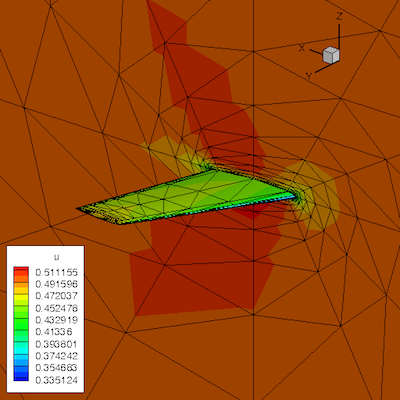
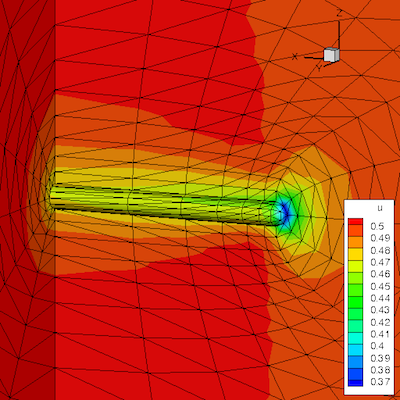

# EDU3D: Educationally-Designed Unstructured 3D Code

This is an implicit unstructured-grid Euler solver (f90, serial, tetra only), written for an educational purpose. Read the source code and learn how a node-centered edge-based unstructured-grid solver is written. Example cases are included: MMS test, cube, hemisphere cylinder, and ONERA M6 wing.




For the grid format, see [edu2d3d_unstructured_grid_format](https://github.com/idolikecfd/edu2d3d_unstructured_grid_format).


## Building

```
mkdir build
cd build
cmake ..
make -j12
```


## Testing

The test suite includes the following tests:

* **mms_te**: truncation error analysis
* **cube_freestream**: the cube-freestream case
* **hc_half**: the hemisphere-cylinder (half-geometry) case
* **om6**: the OM6 wing case

Run all tests at once:

```
ctest
```

Run all tests at once (verbose mode):

```
ctest -V
```


## Next Steps

Now, go into each testcase directory and check the results:

1. Plot the boundary grid and solutions.
2. See fort.1000/2000 to see how the iteration converged.

